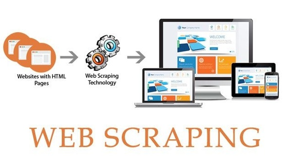

> Assignment 1  

# Crawl a web site and save the content in markdown
  

Choose a website of your own choice or use the website at https://clbokea.github.io/exam/index.html. Crawl it and "Scrape" it.  

The content of the website should be saved in markdown formatted files on your computer.  
It can be a good idea to choose a relatively small website.  
It can also be a good idea to have some sort of limit on which links you want to follow.  

What you choose to retrieve from the crawled site is up to you, but you should describe why you chose to do like you did.


## An Example
A html page looking like this:

        
    <!DOCTYPE html>
    <html lang="en">

    <head>
        <meta charset="UTF-8">
        <meta name="viewport" content="width=device-width, initial-scale=1.0">
        <meta http-equiv="X-UA-Compatible" content="ie=edge">
        <link href="https://stackpath.bootstrapcdn.com/bootstrap/4.3.1/css/bootstrap.min.css" rel="stylesheet"
            integrity="sha384-ggOyR0iXCbMQv3Xipma34MD+dH/1fQ784/j6cY/iJTQUOhcWr7x9JvoRxT2MZw1T"
            crossorigin="anonymous">
        <title>Index</title>
    </head>

    <body>
        <nav class="nav">
            <a class="nav-link active" href="index.html">Home</a>
            <a class="nav-link" href="about.html">About</a>
            <a class="nav-link" href="contact.html">Contact</a>
        </nav>
        <div class="container">
            <h1>Clbo company</h1>
            <p>Welcome home!</p>
            <p>Here you have a list of our services</p>
            <ul>
                <li>Web Scraping</li>
                <li>Web Design</li>
                <li>Backend development</li>
            </ul>
        </div>
    </body>

    </html>

Becomes:  

````
    # Clbo company
    Welcome home!
    Here you have a list of our services
    * Web Scraping
    * Web Design
    * Backend development
````
The links to follow (crawl) would in this case be "about.html" and "contact.html"  

## Important!

> Be sure too read the general requirements for all projects on [this page](../readme.md)


&copy; clbo@kea.dk, 14-05-2019

